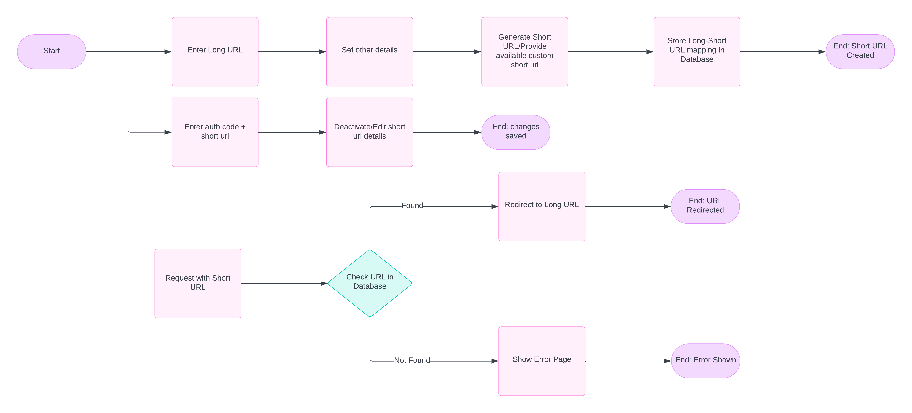
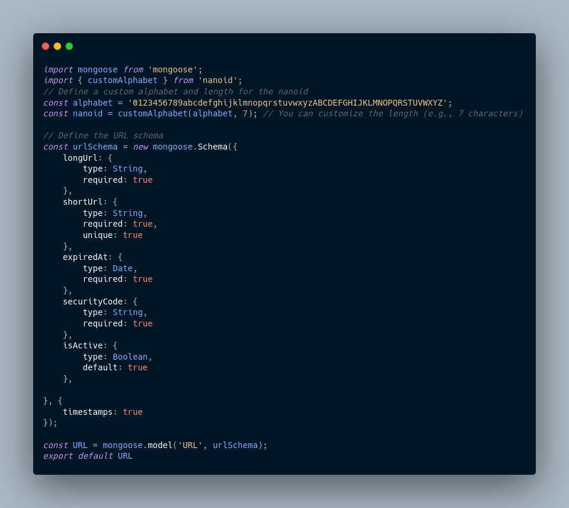

<h1 style="text-decoration:underline;">SOFTWARE FLOW</h1>

**ACTIVITY DIAGRAM**

  <h2 style="text-decoration:underline;">USER DOCS</h2>

* **Create Short URL**:
    * User submits a long URL and specifies the number of days before deletion.
    * The application generates a short URL and a security code.
    * The application stores the long URL, short URL, security code, and expiry date in the database.
    * The application returns the short URL and security code to the user.
* **Edit Short URL**:
    * User submits the security code and the short URL they want to edit.
    * The application verifies the security code and allows editing the long URL or the expiry date.
    * Updates the database accordingly.
* **Deactivate Short URL**:
    * User submits the security code and the short URL they want to deactivate.
    * The application verifies the security code and marks the short URL as deactivated in the database.
* **Redirect Short URL**:
    * When a short URL is accessed, the application checks if it is active.
    * If active, it redirects to the long URL.
    * If inactive, it returns an appropriate response.

### **2. ER Model:**

* **Entities**:
    * `URL` entity with attributes: `id`, `longUrl`, `shortUrl`, `expiredAt`, `securityCode`, `isActive`, and `createdAt`.
* **Relationships**:
    * User submits a `longUrl` to generate a `shortUrl`.
    * `shortUrl` is associated with a `securityCode` for editing and deactivating the URL.

### **3. Mongoose Schema:**

* Define a schema for the URL shortener: \
Javascript

    

### **4. Endpoints:**

* **Create Short URL**:
    * Accepts a long URL and number of days before deletion.
    * Generates a short URL and security code.
    * Returns the short URL and security code.
    * **POST** `/shorten`: Accepts `longUrl`, `expiredAt`, and possibly `userId`.
    * Returns the generated `shortUrl` and a `securityCode`.
* **Edit Short URL Details**:
    * Accepts a short URL, security code, and new long URL or expiry date.
    * Updates the URL's details if the security code matches.
    * **PUT** `/edit`: Accepts `shortUrl`, `securityCode`, and the new details to update.
    * Returns a success or failure response.
* **Deactivate Short URL**:
    * Accepts a short URL and security code.
    * Marks the URL as deactivated if the security code matches.
    * **PUT** `/deactivate`: Accepts `shortUrl` and `securityCode`.
    * Sets `deactivated` to true and returns a success or failure response.
* **Redirect Short URL**:
    * Redirects the user to the long URL if the short URL is active.
    * Returns a message if the short URL is inactive.
    * **GET** `/:shortUrl`: Checks if the URL is active and redirects to the long URL or returns an error.

### **5. Short URL Deactivation:**

* **User Deactivation**: Since only the user who created the short URL has the security code, they should be the only ones who can deactivate the URL.
* **Deactivated URL Availability**: If the short URL is deactivated, it should remain associated with the original user and not be available to other users. This ensures privacy and avoids potential conflicts.

**LATER**

* Optional user authentication
* Accessing and editing all created urls(active or inactive), by an active user by the active user.
